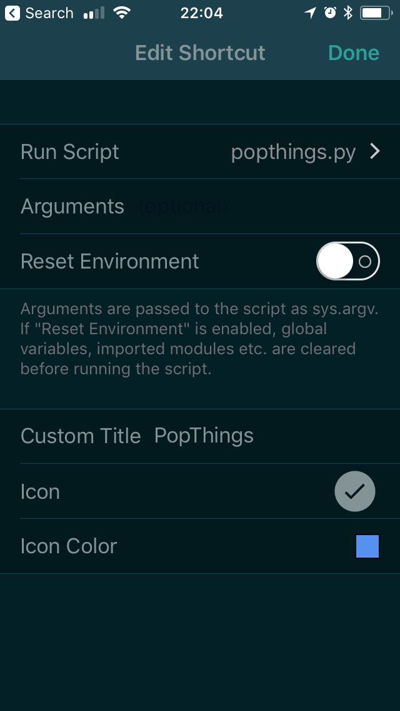
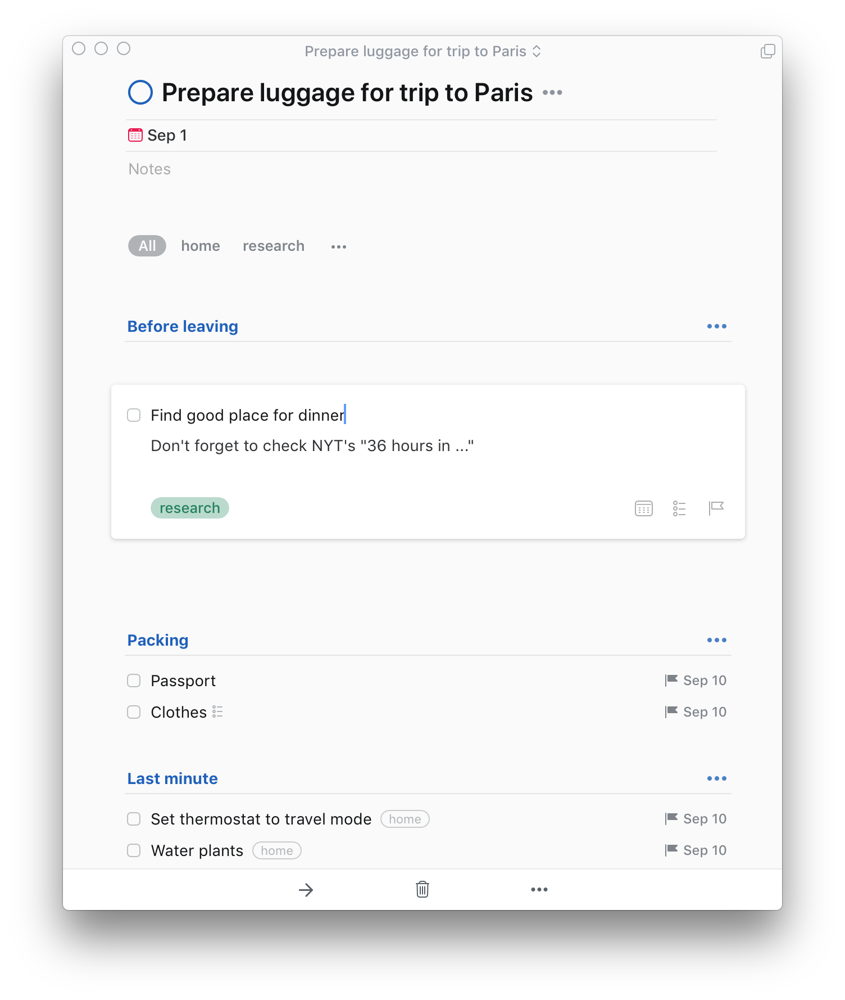
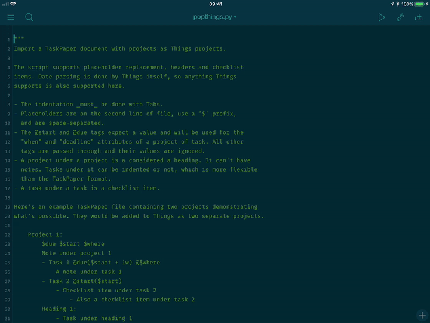

# popthings

iOS and command line tool to import a TaskPaper template with placeholders
into Things by Cultured Code

## Installation

### On macOS

Install popthings using pip. Both Python 2 and Python 3 are supported.

```bash
$ pip install popthings
```

### On iOS

Use
[Pythonista](https://itunes.apple.com/us/app/pythonista-3/id1085978097?ls=1&mt=8)
to execute the script. Download the [`popthings.py`](./popthings.py)
file to the "This iPhone/iPad" location. The script cannot be on iCloud
if you want to use the Share Sheet Extension. To add popthings to
the Share Extension shortcut, add the `popthings.py` script as
a new shortcut in the Pythonista settings. See the [Pythonista
Documentation](http://omz-software.com/pythonista/docs/ios/pythonista.html')
for more details.



To add a button on the Today Widget, use the following entry for the
`SHORTCUT` variable in the `Examples/Widget/Launcher.py` file:

```python
{
    'title': 'PopThings',
    'url': 'pythonista3://popthings.py?action=run',
    'color': '#5e96ff',
    'icon': 'iow:checkmark_24'
},
```

## Usage

`popthings` supports placeholder replacement, headers and checklist items.
Date parsing is done by Things itself, so anything Things supports is also
supported here.

- The indentation _must_ be done with Tabs, which is the normal TaskPaper behavior.
- Placeholders must be defined on the second line of the file. They must have
  a `$` prefix and be space-separated.
- The `@start` and `@due` tags expect a value and will be used for the "when"
  and "deadline" attributes of a project or task. All other tags are passed
  through and their values are ignored.
- A project under a project is a considered a heading. It can't have notes.
  Tasks under it can be indented or not, which is more flexible than the
  TaskPaper format.
- A task under a task is a checklist item.

Here is a packing list template with 3 placeholders:

```taskpaper
Prepare luggage for trip to $destination: @start($start)
    $start $due $destination
    Before leaving:
        - Find good place for dinner @research
            Don't forget to check NYT's "36 hours in ..."
    Packing:
        - Passport @due($due)
        - Clothes @due($due)
            - Pants
            - T-shirts
    Last minute: @due($due)
        - Set thermostat to travel mode @due($due) @home
        - Water plants @due($due) @home
```

To import the template on the Mac, pass the TaskPaper filename to the
`popthings` executable. If there are any placeholders, you'll be prompted for
their value.

```bash
$ popthings templatex-travel.taskpaper
Start value? 2018-09-01
Due value? 2018-09-10
Destination value? Paris
```

Here's the result of parsing the template above.



On iOS, you can use popthings via:

- **The Share Sheet** to share the content of a TaskPaper document from any
  application.
- **From Pythonista or from the Today Widget** where you'll be prompted to
  pick a file using the File picker.

In both cases, Pythonista will prompt you for the placeholder values if there
are any.


## Known limitations

- The TaskPaper file must start with a project.
- If a header has a comment, the previous task or project is going to end up
  with that comment.
